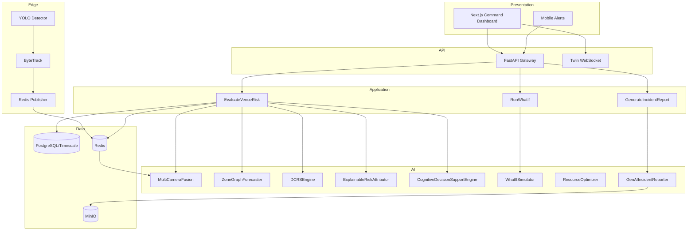

# Component UML (Mermaid)

```mermaid
flowchart TB
  subgraph Presentation
    UI[Next.js Command Dashboard]
    Mobile[Mobile Alerts]
  end

  subgraph API
    GW[FastAPI Gateway]
    WS[Twin WebSocket]
  end

  subgraph Application
    UC1[EvaluateVenueRisk]
    UC2[RunWhatIf]
    UC3[GenerateIncidentReport]
  end

  subgraph AI
    FUS[MultiCameraFusion]
    FOR[ZoneGraphForecaster]
    DCRS[DCRSEngine]
    ERA[ExplainableRiskAttributor]
    CDSE[CognitiveDecisionSupportEngine]
    SIM[WhatIfSimulator]
    OR[ResourceOptimizer]
    GEN[GenAIIncidentReporter]
  end

  subgraph Edge
    DET[YOLO Detector]
    TRK[ByteTrack]
    PUB[Redis Publisher]
  end

  subgraph Data
    PG[(PostgreSQL/Timescale)]
    RD[(Redis)]
    S3[(MinIO)]
  end

  UI --> GW
  UI --> WS
  Mobile --> GW
  GW --> UC1 & UC2 & UC3
  UC1 --> FUS & FOR & DCRS & ERA & CDSE
  UC2 --> SIM
  UC3 --> GEN
  DET --> TRK --> PUB --> RD --> FUS
  UC1 --> PG & RD
  GEN --> S3
```
