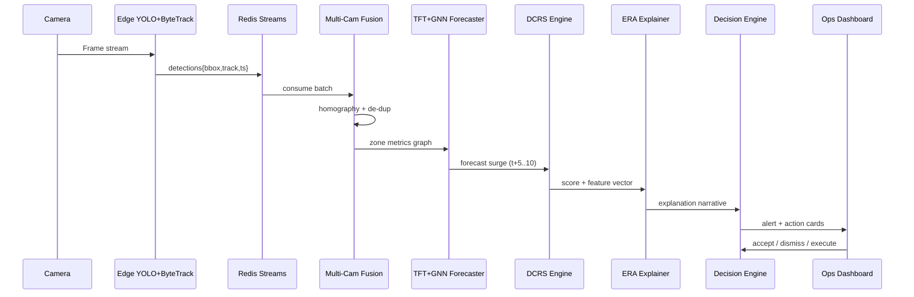

# VigilantTwin — Sequence: Detection → Decision

```mermaid
sequenceDiagram
    participant Cam as Camera
    participant Edge as Edge YOLO+ByteTrack
    participant Redis as Redis Streams
    participant Fusion as Multi-Cam Fusion
    participant Forecast as TFT+GNN Forecaster
    participant Risk as DCRS Engine
    participant XAI as ERA Explainer
    participant CDSE as Decision Engine
    participant UI as Ops Dashboard

    Cam->>Edge: Frame stream
    Edge->>Redis: detections{bbox,track,ts}
    Redis->>Fusion: consume batch
    Fusion->>Fusion: homography + de-dup
    Fusion->>Forecast: zone metrics graph
    Forecast->>Risk: forecast surge (t+5..10)
    Risk->>XAI: score + feature vector
    XAI->>CDSE: explanation narrative
    CDSE->>UI: alert + action cards
    UI->>CDSE: accept / dismiss / execute
```
